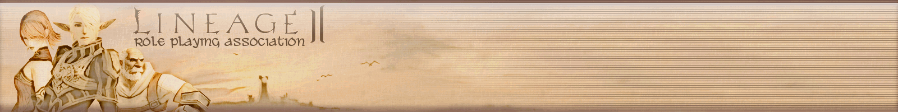

### Статьи для самых непонятливых:
> [🇷🇺](https://ru.wikipedia.org/wiki/Lineage_(компьютерная_игра)) [🇬🇧](https://en.wikipedia.org/wiki/Lineage_(video_game)) `Родословная, игра 1998 года, первая игра в сеттинге с 2D изометрической графикой; происходила за 150 лет до событий следующей игры`
> 
> [🇷🇺](https://ru.wikipedia.org/wiki/Lineage_II) [🇬🇧](https://en.wikipedia.org/wiki/Lineage_II) `Родословная ][, нетленная классика ММОРПГ, вышедшая в 2003 году, в объяснении не нуждается`
>
> [🇮🇱](http://neolurk.org/wiki/Lineage_II) `Статья о сабже на **нео**лурке, рекомендуется к прочтению`
> 
> [🇬🇧](https://en.wikipedia.org/wiki/Lineage_2:_Revolution) `Родословная ][: Революция: в 2017 корейцы из НЦМягкий решили подоить шекелей с карликов`
> 
> [🇬🇧](https://en.wikipedia.org/wiki/Lineage_W) `Родословная Дабл-Ю: карлики два, ~~калон имус ест и просит добавки~~ на этот раз в сеттинге Линиг 1, вышла в 2021 году`
> 
> [🇷🇺](https://ru.wikipedia.org/wiki/Lineage_Eternal:_Twilight_Resistance) [🇬🇧](https://en.wikipedia.org/wiki/Throne_and_Liberty) `Трон и Свобода, он же проект ТЛ, он же Родословная ]I[, он же Родословная Вечный: НЦМягкий давненько решила сделать игру на новом движке, однако день ото дня отодвигает сроки релиза`

### Лор
> [🇷🇺](https://l2db.ru/articles/1) [🇬🇧](https://forums.lineage2.com/topic/6018-the-past-the-lore-of-the-game-and-love-for-l2-erased/?do=findComment&comment=48182) `Собственно текстовый вариант лора Родословная ][ от лица некоего барда (на самом деле Гран Каина)`
>
>`Также лор содержится в арт и гайдбуках от НЦСофт и подробно разобран в видео FocusDeath на его ютуб канале, ссылки на всё это найдешь в разделе с картинками`

|[↩️](header.md)|[ℹ️](info.md)|[🔮](arts.md)|
|:---:|:---:|:---:|
